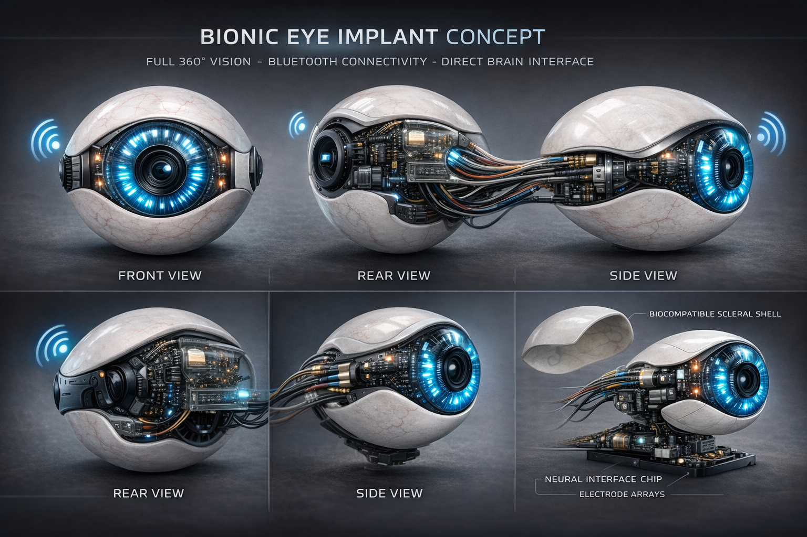

# Bionic Eye Controller

A conceptual Python program for controlling a simulated bionic eye device with augmented features such as changing iris color, zoom, night vision, augmented reality overlays, and more. This project demonstrates auto-installation of dependencies (using the `--break-system-packages` flag) and simulates USB/wireless communication with the device.
# Lookslike



> **Warning:**  
> This code is purely conceptual and for educational purposes only. It is not intended for production use or interfacing with actual medical devices. It is highly recommended to use a virtual environment for development to avoid system-wide package issues.

## Features

- **Dynamic Iris Color:** Change the iris color using commands.
- **Optical Zoom:** Adjust the zoom level.
- **Night Vision:** Toggle night vision mode.
- **Augmented Reality Overlays:** Activate AR overlays.
- **Custom Functions:** Execute additional custom commands.
- **Auto-Installation:** Automatically installs required Python packages (`pyusb` and `pyserial`) if not found (using `--break-system-packages`).
- **Simulated USB/Wireless Communication:** Simulates device communication if the required modules are not available.

## Requirements

- Python 3.6+
- (Recommended) A virtual environment to avoid conflicts with system-wide packages

## Installation

1. **Clone the repository:**

   ```bash
   git clone https://github.com/xatusbetazx17/Bionic-Eye-Controller.git
   cd Bionic-Eye-Controller
(Optional) Create and activate a virtual environment:

bash
Copy
python -m venv venv
source venv/bin/activate   # On Windows, use: venv\Scripts\activate
Run the script:

The script will try to install any missing dependencies automatically. If your environment is externally managed, the script uses the --break-system-packages flag.
Note: It is recommended to use a virtual environment.

bash
Copy
python bionic_eye_controller.py
Usage
Once running, you will see a command-line interface. Type help for a list of available commands. Here are some examples:

Change Iris Color:

plaintext
Copy
>> change_color #FF5733
Set Optical Zoom:

plaintext
Copy
>> zoom 2.5
Toggle Night Vision:

plaintext
Copy
>> night on
>> night off
Activate AR Overlay:

plaintext
Copy
>> ar YourOverlayDataHere
Run System Diagnostics:

plaintext
Copy
>> diag
Run a Custom Function:

plaintext
Copy
>> custom FUNCTION_CODE
Exit the Program:

plaintext
Copy
>> exit
Repository Structure
bionic_eye_controller.py:
The main Python script that implements the bionic eye controller with all features and auto-installation of dependencies.

README.md:
This file, explaining the project.

.gitignore:
Recommended to ignore environment files and caches. See the file content below.

.gitignore
gitignore
Copy
# Ignore Python cache files and virtual environments
__pycache__/
*.pyc
venv/
License
This project is provided for educational purposes only.
MIT License

Disclaimer:
This is a conceptual project. In a real-world scenario, interfacing with bionic implants involves rigorous testing, security measures, and adherence to strict medical and safety standards.

python
Copy


### bionic_eye_controller.py

~~~
#!/usr/bin/env python3
import subprocess
import sys
import time
import sqlite3
import threading

# --- Dependency Auto-Installation ---
def install_package(package_name):
    """
    Installs a Python package using pip with the --break-system-packages flag.
    WARNING: This may override system package management.
    """
    try:
        print(f"Attempting to install {package_name}...")
        subprocess.check_call([sys.executable, "-m", "pip", "install", package_name, "--break-system-packages"])
        print(f"{package_name} installed successfully.")
    except subprocess.CalledProcessError as e:
        print(f"Failed to install {package_name}: {e}")

# Required packages for hardware and vision.
for pkg, module in [
    ("pyusb", "usb"),
    ("pyserial", "serial"),
    ("opencv-python", "cv2"),
    ("numpy", "numpy"),
    ("mediapipe", "mp"),
    ("SpeechRecognition", "speech_recognition")
]:
    try:
        __import__(module)
    except ImportError:
        install_package(pkg)

# Now import after installation attempts.
try:
    import usb.core
    import usb.util
except ImportError:
    usb = None
try:
    import serial
except ImportError:
    serial = None
try:
    import cv2
except ImportError:
    cv2 = None
try:
    import numpy as np
except ImportError:
    np = None
try:
    import mediapipe as mp
except ImportError:
    mp = None
try:
    import speech_recognition as sr
except ImportError:
    sr = None

# --- Database Logging for Firmware Updates ---
def log_firmware_update(update_method):
    """Logs firmware update events in a SQLite database."""
    try:
        conn = sqlite3.connect("user_preferences.db")
        c = conn.cursor()
        c.execute("""
            CREATE TABLE IF NOT EXISTS firmware_updates (
                id INTEGER PRIMARY KEY AUTOINCREMENT,
                update_method TEXT,
                timestamp DATETIME DEFAULT CURRENT_TIMESTAMP
            )
        """)
        c.execute("INSERT INTO firmware_updates (update_method) VALUES (?)", (update_method,))
        conn.commit()
        conn.close()
        print("Firmware update logged in database.")
    except Exception as e:
        print("Failed to log firmware update:", e)

# --- Bionic Eye Controller with Advanced Features ---
class BionicEyeController:
    """
    A conceptual controller for a bionic eye device.
    Automatically detects the connection type (USB, wireless, or simulation).
    Provides methods for basic and advanced features.
    """
    def __init__(self, connection_type="auto", port=None, debug=True):
        self.debug = debug
        self.device = None
        self.ser = None

        if connection_type == "auto":
            self.auto_detect_connection(port)
        elif connection_type in ["usb", "wireless"]:
            self.connection_type = connection_type
            if connection_type == "usb":
                self.initialize_usb()
            else:
                self.initialize_wireless(port)
        else:
            raise ValueError("Unsupported connection type: " + connection_type)

    def auto_detect_connection(self, port):
        """Try USB first, then wireless, then fall back to simulation."""
        if usb is not None:
            self.device = usb.core.find(idVendor=0x1234, idProduct=0x5678)
            if self.device is not None:
                try:
                    self.device.set_configuration()
                    self.connection_type = "usb"
                    if self.debug:
                        print("Auto-detected USB device. Using USB connection.")
                    return
                except Exception as e:
                    if self.debug:
                        print("USB detected but configuration failed:", e)
                    self.device = None
        if serial is not None:
            possible_ports = ["/dev/ttyUSB0", "/dev/ttyACM0", "COM3", "COM4"]
            for p in possible_ports:
                try:
                    self.ser = serial.Serial(p, baudrate=115200, timeout=1)
                    self.connection_type = "wireless"
                    if self.debug:
                        print(f"Auto-detected wireless device on port {p}. Using wireless connection.")
                    return
                except Exception as e:
                    if self.debug:
                        print(f"Port {p} not available: {e}")
                    continue
        self.connection_type = "simulation"
        if self.debug:
            print("No hardware detected. Running in simulation mode.")

    def initialize_usb(self):
        """Initialize USB connection."""
        if usb is None:
            if self.debug:
                print("USB module not available; simulating USB connection.")
            self.device = None
            return
        self.device = usb.core.find(idVendor=0x1234, idProduct=0x5678)
        if self.device is None:
            if self.debug:
                print("USB device not found; simulating USB connection.")
        else:
            try:
                self.device.set_configuration()
                if self.debug:
                    print("USB device initialized.")
            except Exception as e:
                if self.debug:
                    print("Failed to configure USB device; simulating USB connection:", e)
                self.device = None

    def initialize_wireless(self, port):
        """Initialize wireless (serial) connection."""
        if serial is None:
            if self.debug:
                print("Serial module not available; simulating wireless connection.")
            self.ser = None
            return
        if port is None:
            port = '/dev/ttyUSB0'
        try:
            self.ser = serial.Serial(port, baudrate=115200, timeout=1)
            if self.debug:
                print("Wireless device initialized on port:", port)
        except Exception as e:
            if self.debug:
                print("Wireless initialization failed; simulating wireless connection:", e)
            self.ser = None

    def send_command(self, command: str):
        """Send a command to the device (or simulate by printing)."""
        if self.connection_type == "usb":
            if self.device is None:
                print(f"[USB Simulation] Command sent: {command}")
            else:
                print(f"[USB] Sending command: {command}")
        elif self.connection_type == "wireless":
            if self.ser is None:
                print(f"[Wireless Simulation] Command sent: {command}")
            else:
                self.ser.write((command + "\n").encode('ascii'))
                print(f"[Wireless] Sending command: {command}")
        else:
            print(f"[Simulation] Command sent: {command}")

    # Basic feature methods:
    def change_iris_color(self, color: str):
        self.send_command(f"SET_IRIS_COLOR {color}")

    def set_zoom_level(self, level: float):
        self.send_command(f"SET_ZOOM {level}")

    def enable_night_vision(self, enable: bool = True):
        self.send_command("NIGHT_VISION ON" if enable else "NIGHT_VISION OFF")

    def activate_AR_overlay(self, overlay_data: str):
        self.send_command(f"ACTIVATE_AR {overlay_data}")

    def run_custom_function(self, function_code: str):
        self.send_command(f"RUN_CUSTOM {function_code}")

    def system_diagnostics(self):
        self.send_command("DIAGNOSTICS")
        return "Diagnostics: All systems nominal."

    def update_firmware(self, update_method="online"):
        if update_method == "online":
            self.send_command("UPDATE_FIRMWARE_ONLINE")
            log_firmware_update("online")
            return "Firmware update via online store initiated."
        else:
            self.send_command("UPDATE_FIRMWARE_LOCAL")
            log_firmware_update("local")
            return "Firmware update from local file initiated."

    def enable_infrared(self, enable: bool = True):
        self.send_command("INFRARED_ON" if enable else "INFRARED_OFF")
        return "Infrared mode enabled" if enable else "Infrared mode disabled"

    def capture_photo(self):
        self.send_command("CAPTURE_PHOTO")
        return "Photo captured"

    def check_battery(self):
        self.send_command("CHECK_BATTERY")
        return "Battery: 85%"

    def set_eye_appearance(self, appearance: str):
        """
        Set the eye appearance to a specific pattern.
        Options: Default, Sharingan, Mangekyou Sharingan, Sage Mode, Tenseigan, Rinnegan.
        """
        self.send_command(f"SET_APPEARANCE {appearance}")
        print(f"Appearance set to {appearance}")

    # Advanced feature methods:
    def ai_enhance_vision(self):
        """Activate AI-enhanced vision (object detection, scene enhancement, etc.)."""
        self.send_command("AI_ENHANCE_VISION")
        print("AI vision enhancement activated.")

    def auto_contrast(self):
        """Automatically adjust contrast based on scene analysis."""
        self.send_command("AUTO_CONTRAST")
        print("Auto contrast activated.")

    def scene_segmentation(self):
        """Activate scene segmentation to highlight objects/obstacles."""
        self.send_command("SCENE_SEGMENTATION")
        print("Scene segmentation activated.")

# --- Voice Command Interface ---
def voice_command_listener(controller):
    """
    Continuously listens for voice commands and maps them to controller functions.
    Uses the SpeechRecognition library.
    """
    if sr is None:
        print("Voice recognition library not available.")
        return
    recognizer = sr.Recognizer()
    mic = sr.Microphone()
    # Define a simple mapping of phrases to controller methods.
    commands = {
        "change color": lambda: controller.change_iris_color("#FF0000"),
        "zoom": lambda: controller.set_zoom_level(2.0),
        "night vision": lambda: controller.enable_night_vision(True),
        "infrared": lambda: controller.enable_infrared(True),
        "ar overlay": lambda: controller.activate_AR_overlay("Default AR Overlay"),
        "capture photo": lambda: print(controller.capture_photo()),
        "diagnostics": lambda: print(controller.system_diagnostics()),
        "battery": lambda: print(controller.check_battery()),
        "update": lambda: print(controller.update_firmware("online")),
        "ai enhance": lambda: controller.ai_enhance_vision(),
        "auto contrast": lambda: controller.auto_contrast(),
        "scene segmentation": lambda: controller.scene_segmentation(),
        "customize appearance": lambda: appearance_customization_interface(controller)
    }
    with mic as source:
        recognizer.adjust_for_ambient_noise(source)
    print("Voice command listener active. Say a command...")
    while True:
        try:
            with mic as source:
                audio = recognizer.listen(source, phrase_time_limit=3)
            command_text = recognizer.recognize_google(audio).lower()
            print(f"Voice recognized: {command_text}")
            for phrase, action in commands.items():
                if phrase in command_text:
                    action()
                    break
        except sr.UnknownValueError:
            pass  # Could not understand audio
        except sr.RequestError as e:
            print(f"Voice recognition error: {e}")
        # To allow graceful exit if needed, check a global flag or similar (omitted for brevity).

# --- Sub-Interface: Firmware Update ---
def firmware_update_interface(controller):
    """Displays a firmware update sub-menu."""
    if cv2 is None or np is None or mp is None:
        print("Necessary libraries missing. Simulating firmware update...")
        feedback = controller.update_firmware(update_method="online")
        time.sleep(1)
        return feedback

    cap = cv2.VideoCapture(0)
    if not cap.isOpened():
        print("Camera not available. Simulating firmware update...")
        feedback = controller.update_firmware(update_method="online")
        time.sleep(1)
        return feedback

    sub_options = ["Local File", "Online Update"]
    menu_x, menu_y, menu_width, option_height = 100, 150, 300, 50
    option_threshold = 1.5
    option_times = {opt: None for opt in sub_options}
    smoothed_pointer = None
    alpha = 0.3
    feedback = ""
    feedback_time = time.time()
    feedback_duration = 3.0

    while True:
        ret, frame = cap.read()
        if not ret:
            feedback = controller.update_firmware(update_method="online")
            time.sleep(1)
            break
        frame = cv2.flip(frame, 1)
        frame_h, frame_w, _ = frame.shape
        image_rgb = cv2.cvtColor(frame, cv2.COLOR_BGR2RGB)
        results = mp.solutions.hands.Hands(max_num_hands=1).process(image_rgb)
        pointer = None
        if results.multi_hand_landmarks:
            for landmarks in results.multi_hand_landmarks:
                x = landmarks.landmark[8].x * frame_w
                y = landmarks.landmark[8].y * frame_h
                pointer = (int(x), int(y))
                break
        if pointer is not None:
            if smoothed_pointer is None:
                smoothed_pointer = pointer
            else:
                smoothed_pointer = (
                    int(alpha * pointer[0] + (1 - alpha) * smoothed_pointer[0]),
                    int(alpha * pointer[1] + (1 - alpha) * smoothed_pointer[1])
                )
            cv2.circle(frame, smoothed_pointer, 5, (0, 255, 0), -1)
        else:
            smoothed_pointer = None

        curr_time = time.time()
        overlay = frame.copy()
        cv2.rectangle(overlay, (menu_x, menu_y), (menu_x + menu_width, menu_y + len(sub_options)*option_height), (50,50,50), -1)
        cv2.addWeighted(overlay, 0.6, frame, 0.4, 0, frame)

        for idx, opt in enumerate(sub_options):
            ox = menu_x
            oy = menu_y + idx * option_height
            cv2.rectangle(frame, (ox, oy), (ox + menu_width, oy + option_height), (100,100,100), 1)
            cv2.putText(frame, opt, (ox + 10, oy + 35), cv2.FONT_HERSHEY_SIMPLEX, 0.8, (255,255,255), 2)
            if smoothed_pointer is not None and ox <= smoothed_pointer[0] <= ox + menu_width and oy <= smoothed_pointer[1] <= oy + option_height:
                if option_times[opt] is None:
                    option_times[opt] = curr_time
                dwell = curr_time - option_times[opt]
                prog_width = int((dwell / option_threshold) * menu_width)
                prog_width = min(prog_width, menu_width)
                cv2.rectangle(frame, (ox, oy), (ox + prog_width, oy + option_height), (0,255,0), -1)
                if dwell >= option_threshold:
                    if opt == "Local File":
                        feedback = controller.update_firmware(update_method="local")
                    elif opt == "Online Update":
                        feedback = controller.update_firmware(update_method="online")
                    feedback_time = curr_time
                    break
            else:
                option_times[opt] = None

        cv2.putText(frame, "Select Firmware Update Method", (menu_x, menu_y - 20),
                    cv2.FONT_HERSHEY_SIMPLEX, 0.8, (255,255,255), 2)
        if feedback and (curr_time - feedback_time) < feedback_duration:
            cv2.putText(frame, feedback, (menu_x, menu_y + len(sub_options)*option_height + 40),
                        cv2.FONT_HERSHEY_SIMPLEX, 0.8, (0,0,255), 2)
        elif curr_time - feedback_time >= feedback_duration and feedback:
            cv2.putText(frame, "Restarting view...", (menu_x, menu_y + len(sub_options)*option_height + 80),
                        cv2.FONT_HERSHEY_SIMPLEX, 0.8, (0,0,255), 2)
            cv2.imshow("Firmware Update", frame)
            cv2.waitKey(2000)
            break

        cv2.imshow("Firmware Update", frame)
        if cv2.waitKey(1) & 0xFF == ord('q'):
            break

    cap.release()
    cv2.destroyWindow("Firmware Update")
    return feedback

# --- Sub-Interface: Appearance Customization ---
def appearance_customization_interface(controller):
    """Displays a sub-menu to select an eye appearance pattern."""
    if cv2 is None or np is None or mp is None:
        print("Libraries missing. Simulating appearance customization...")
        controller.set_eye_appearance("Default")
        time.sleep(1)
        return "Appearance set to Default"

    cap = cv2.VideoCapture(0)
    if not cap.isOpened():
        print("Camera not available. Simulating appearance selection...")
        controller.set_eye_appearance("Default")
        time.sleep(1)
        return "Appearance set to Default"

    appearance_options = ["Default", "Sharingan", "Mangekyou Sharingan", "Sage Mode", "Tenseigan", "Rinnegan"]
    menu_x, menu_y, menu_width, option_height = 100, 150, 300, 50
    option_threshold = 1.5
    option_times = {opt: None for opt in appearance_options}
    smoothed_pointer = None
    alpha = 0.3
    feedback = ""
    feedback_time = time.time()
    feedback_duration = 3.0

    while True:
        ret, frame = cap.read()
        if not ret:
            print("Failed to capture frame. Simulating appearance selection...")
            controller.set_eye_appearance("Default")
            time.sleep(1)
            break

        frame = cv2.flip(frame, 1)
        frame_h, frame_w, _ = frame.shape
        image_rgb = cv2.cvtColor(frame, cv2.COLOR_BGR2RGB)
        results = mp.solutions.hands.Hands(max_num_hands=1).process(image_rgb)
        pointer = None
        if results.multi_hand_landmarks:
            for landmarks in results.multi_hand_landmarks:
                x = landmarks.landmark[8].x * frame_w
                y = landmarks.landmark[8].y * frame_h
                pointer = (int(x), int(y))
                break

        if pointer is not None:
            if smoothed_pointer is None:
                smoothed_pointer = pointer
            else:
                smoothed_pointer = (
                    int(alpha * pointer[0] + (1 - alpha) * smoothed_pointer[0]),
                    int(alpha * pointer[1] + (1 - alpha) * smoothed_pointer[1])
                )
            cv2.circle(frame, smoothed_pointer, 5, (0, 255, 0), -1)
        else:
            smoothed_pointer = None

        curr_time = time.time()
        overlay = frame.copy()
        cv2.rectangle(overlay, (menu_x, menu_y), (menu_x + menu_width, menu_y + len(appearance_options)*option_height), (50,50,50), -1)
        cv2.addWeighted(overlay, 0.6, frame, 0.4, 0, frame)

        for idx, opt in enumerate(appearance_options):
            ox = menu_x
            oy = menu_y + idx * option_height
            cv2.rectangle(frame, (ox, oy), (ox + menu_width, oy + option_height), (100,100,100), 1)
            cv2.putText(frame, opt, (ox + 10, oy + 35), cv2.FONT_HERSHEY_SIMPLEX, 0.8, (255,255,255), 2)
            if smoothed_pointer is not None and ox <= smoothed_pointer[0] <= ox + menu_width and oy <= smoothed_pointer[1] <= oy + option_height:
                if option_times[opt] is None:
                    option_times[opt] = curr_time
                dwell = curr_time - option_times[opt]
                prog_width = int((dwell / option_threshold) * menu_width)
                prog_width = min(prog_width, menu_width)
                cv2.rectangle(frame, (ox, oy), (ox + prog_width, oy + option_height), (0,255,0), -1)
                if dwell >= option_threshold:
                    controller.set_eye_appearance(opt)
                    feedback = f"Appearance set to {opt}"
                    feedback_time = curr_time
                    break
            else:
                option_times[opt] = None

        cv2.putText(frame, "Select Appearance", (menu_x, menu_y - 20),
                    cv2.FONT_HERSHEY_SIMPLEX, 0.8, (255,255,255), 2)
        if feedback and (curr_time - feedback_time) < feedback_duration:
            cv2.putText(frame, feedback, (menu_x, menu_y + len(appearance_options)*option_height + 40),
                        cv2.FONT_HERSHEY_SIMPLEX, 0.8, (0,0,255), 2)
        elif curr_time - feedback_time >= feedback_duration and feedback:
            cv2.putText(frame, "Restarting view...", (menu_x, menu_y + len(appearance_options)*option_height + 80),
                        cv2.FONT_HERSHEY_SIMPLEX, 0.8, (0,0,255), 2)
            cv2.imshow("Appearance Customization", frame)
            cv2.waitKey(2000)
            break

        cv2.imshow("Appearance Customization", frame)
        if cv2.waitKey(1) & 0xFF == ord('q'):
            break

    cap.release()
    cv2.destroyWindow("Appearance Customization")
    return feedback

# --- Main Hand-Controlled Interface with Scrolling Menu and Voice Commands ---
def hand_control_interface(controller):
    """
    Displays a live camera feed with a toggleable, hand-controlled, scrollable menu.
    Menu options include advanced features:
      - Customize Appearance (opens appearance sub-menu)
      - Change Color
      - Zoom
      - Night Vision
      - Infrared
      - AR Overlay
      - Capture Photo
      - Diagnostics
      - Battery
      - Update (opens firmware update sub-menu)
      - AI Enhance (activates AI-based vision enhancement)
      - Auto Contrast (automatically adjusts contrast)
      - Scene Segmentation (activates scene segmentation)
    Additionally, a separate voice command listener runs in parallel to accept spoken commands.
    Press 'q' to exit.
    """
    if cv2 is None or np is None or mp is None:
        print("Necessary libraries not available. Exiting interface.")
        return

    # Start voice command listener in a separate thread.
    if sr is not None:
        voice_thread = threading.Thread(target=voice_command_listener, args=(controller,), daemon=True)
        voice_thread.start()

    cap = cv2.VideoCapture(0)
    if not cap.isOpened():
        print("Cannot open camera for interface.")
        return

    mp_hands = mp.solutions.hands
    hands = mp_hands.Hands(max_num_hands=1)
    mp_drawing = mp.solutions.drawing_utils

    menu_open = False
    menu_toggle_dwell = None
    menu_toggle_threshold = 2.0
    frame_width, frame_height = 640, 480
    toggle_region_center = (frame_width - 40, 40)
    toggle_region_radius = 30

    # Extended menu options.
    menu_options = [
        "Customize Appearance",
        "Change Color",
        "Zoom",
        "Night Vision",
        "Infrared",
        "AR Overlay",
        "Capture Photo",
        "Diagnostics",
        "Battery",
        "Update",
        "AI Enhance",
        "Auto Contrast",
        "Scene Segmentation"
    ]
    visible_count = 5  # Number of options visible at once.
    scroll_offset = 0
    option_height = 40
    menu_x, menu_y, menu_width = 50, 100, 200
    visible_menu_height = visible_count * option_height
    option_threshold = 1.5
    option_times = {opt: None for opt in menu_options}
    feedback = ""
    feedback_time = time.time()
    feedback_duration = 3.0
    smoothed_pointer = None
    alpha = 0.3

    while True:
        ret, frame = cap.read()
        if not ret:
            print("Failed to capture frame.")
            break

        frame = cv2.flip(frame, 1)
        frame_h, frame_w, _ = frame.shape
        image_rgb = cv2.cvtColor(frame, cv2.COLOR_BGR2RGB)
        results = hands.process(image_rgb)
        pointer = None
        if results.multi_hand_landmarks:
            for landmarks in results.multi_hand_landmarks:
                mp_drawing.draw_landmarks(frame, landmarks, mp_hands.HAND_CONNECTIONS)
                x = landmarks.landmark[8].x * frame_w
                y = landmarks.landmark[8].y * frame_h
                pointer = (int(x), int(y))
                break

        if pointer is not None:
            if smoothed_pointer is None:
                smoothed_pointer = pointer
            else:
                smoothed_pointer = (
                    int(alpha * pointer[0] + (1 - alpha) * smoothed_pointer[0]),
                    int(alpha * pointer[1] + (1 - alpha) * smoothed_pointer[1])
                )
            cv2.circle(frame, smoothed_pointer, 5, (0, 255, 0), -1)
        else:
            smoothed_pointer = None

        curr_time = time.time()
        # Draw toggle region for menu
        cv2.circle(frame, toggle_region_center, toggle_region_radius, (200,200,200), 2)
        cv2.putText(frame, "Menu", (toggle_region_center[0]-30, toggle_region_center[1]+5),
                    cv2.FONT_HERSHEY_SIMPLEX, 0.5, (200,200,200), 1)

        # Toggle menu open/close
        if smoothed_pointer is not None:
            dx = smoothed_pointer[0] - toggle_region_center[0]
            dy = smoothed_pointer[1] - toggle_region_center[1]
            dist = (dx**2 + dy**2)**0.5
            if dist <= toggle_region_radius:
                if menu_toggle_dwell is None:
                    menu_toggle_dwell = curr_time
                dwell = curr_time - menu_toggle_dwell
                progress_angle = int((dwell / menu_toggle_threshold) * 360)
                cv2.ellipse(frame, toggle_region_center, (toggle_region_radius, toggle_region_radius), 0, 0, progress_angle, (0,255,0), 2)
                if dwell >= menu_toggle_threshold:
                    menu_open = not menu_open
                    menu_toggle_dwell = None
                    option_times = {opt: None for opt in menu_options}
            else:
                menu_toggle_dwell = None

        # If menu is open, implement scrolling.
        if menu_open:
            # Check pointer vertical position for scrolling.
            if smoothed_pointer is not None:
                pointer_y = smoothed_pointer[1]
                if pointer_y < menu_y + 0.2 * visible_menu_height and scroll_offset > 0:
                    scroll_offset -= 1
                    time.sleep(0.1)  # Reduced sleep for faster scrolling
                elif pointer_y > menu_y + 0.8 * visible_menu_height and scroll_offset < len(menu_options) - visible_count:
                    scroll_offset += 1
                    time.sleep(0.1)
            # Draw the visible menu box.
            overlay = frame.copy()
            cv2.rectangle(overlay, (menu_x, menu_y), (menu_x+menu_width, menu_y+visible_menu_height), (50,50,50), -1)
            cv2.addWeighted(overlay, 0.6, frame, 0.4, 0, frame)
            for idx in range(visible_count):
                actual_idx = idx + scroll_offset
                if actual_idx >= len(menu_options):
                    break
                opt = menu_options[actual_idx]
                ox = menu_x
                oy = menu_y + idx * option_height
                cv2.rectangle(frame, (ox, oy), (ox+menu_width, oy+option_height), (100,100,100), 1)
                cv2.putText(frame, opt, (ox+5, oy+30), cv2.FONT_HERSHEY_SIMPLEX, 0.7, (255,255,255), 2)
                if smoothed_pointer is not None and ox <= smoothed_pointer[0] <= ox+menu_width and oy <= smoothed_pointer[1] <= oy+option_height:
                    if option_times[opt] is None:
                        option_times[opt] = curr_time
                    dwell = curr_time - option_times[opt]
                    prog_width = int((dwell/option_threshold) * menu_width)
                    prog_width = min(prog_width, menu_width)
                    cv2.rectangle(frame, (ox, oy), (ox+prog_width, oy+option_height), (0,255,0), -1)
                    if dwell >= option_threshold:
                        print(f"Option selected: {opt}")
                        if opt == "Customize Appearance":
                            appearance_customization_interface(controller)
                            feedback = "Appearance customization complete."
                        elif opt == "Change Color":
                            controller.change_iris_color("#FF0000")
                            feedback = "Iris color changed to #FF0000"
                        elif opt == "Zoom":
                            controller.set_zoom_level(2.0)
                            feedback = "Zoom set to 2.0"
                        elif opt == "Night Vision":
                            controller.enable_night_vision(True)
                            feedback = "Night vision enabled"
                        elif opt == "Infrared":
                            feedback = controller.enable_infrared(True)
                        elif opt == "AR Overlay":
                            controller.activate_AR_overlay("Default AR Overlay")
                            feedback = "AR overlay activated"
                        elif opt == "Capture Photo":
                            feedback = controller.capture_photo()
                        elif opt == "Diagnostics":
                            diag = controller.system_diagnostics()
                            print(diag)
                            feedback = diag
                        elif opt == "Battery":
                            feedback = controller.check_battery()
                        elif opt == "Update":
                            feedback = "Launching firmware update interface..."
                            cv2.imshow("Hand Control Interface", frame)
                            cv2.waitKey(500)
                            firmware_update_interface(controller)
                            feedback = "Firmware update completed."
                        elif opt == "AI Enhance":
                            controller.ai_enhance_vision()
                            feedback = "AI vision enhancement activated."
                        elif opt == "Auto Contrast":
                            controller.auto_contrast()
                            feedback = "Auto contrast activated."
                        elif opt == "Scene Segmentation":
                            controller.scene_segmentation()
                            feedback = "Scene segmentation activated."
                        menu_open = False
                        option_times = {opt: None for opt in menu_options}
                        feedback_time = curr_time
                else:
                    option_times[opt] = None

        cv2.putText(frame, "Hand Control Interface", (menu_x, menu_y - 40),
                    cv2.FONT_HERSHEY_SIMPLEX, 1.0, (255,255,255), 2)
        if feedback and (curr_time - feedback_time) < feedback_duration:
            cv2.putText(frame, feedback, (menu_x, menu_y+visible_menu_height+30),
                        cv2.FONT_HERSHEY_SIMPLEX, 0.8, (0,0,255), 2)
        elif curr_time - feedback_time >= feedback_duration:
            feedback = ""

        cv2.imshow("Hand Control Interface", frame)
        if cv2.waitKey(1) & 0xFF == ord('q'):
            break

    cap.release()
    cv2.destroyAllWindows()

if __name__ == '__main__':
    # Auto-detect connection and initialize the controller.
    controller = BionicEyeController(connection_type="auto", debug=True)
    # Launch the hand-controlled interface with the scrollable menu.
    hand_control_interface(controller)


~~~
        
## .gitignore

Copy

# Ignore Python cache files and virtual environments
__pycache__/
*.pyc
venv/

## How to Create and Push the Repository
Create a new repository on GitHub with the name Bionic-Eye-Controller under your account xatusbetazx17.

Clone the repository locally:

bash
Copy
~~~
git clone https://github.com/xatusbetazx17/Bionic-Eye-Controller.git
cd Bionic-Eye-Controller
~~~
Add the files:
Create the files README.md, bionic_eye_controller.py, and .gitignore with the content provided above.

Commit and push:

bash
Copy
~~~
git add .
git commit -m "Initial commit: Add bionic eye controller project with auto-install functionality"
git push origin main
~~~
## License 

MIT License

Copyright (c) 2025 xatusbetazx17

Permission is hereby granted, free of charge, to any person obtaining a copy
of this software and associated documentation files (the "Software"), to deal
in the Software without restriction, including without limitation the rights
to use, copy, modify, merge, publish, distribute, sublicense, and/or sell
copies of the Software, and to permit persons to whom the Software is
furnished to do so, subject to the following conditions:

The above copyright notice and this permission notice shall be included in all
copies or substantial portions of the Software.

THE SOFTWARE IS PROVIDED "AS IS", WITHOUT WARRANTY OF ANY KIND, EXPRESS OR
IMPLIED, INCLUDING BUT NOT LIMITED TO THE WARRANTIES OF MERCHANTABILITY,
FITNESS FOR A PARTICULAR PURPOSE AND NONINFRINGEMENT. IN NO EVENT SHALL THE
AUTHORS OR COPYRIGHT HOLDERS BE LIABLE FOR ANY CLAIM, DAMAGES OR OTHER
LIABILITY, WHETHER IN AN ACTION OF CONTRACT, TORT OR OTHERWISE, ARISING FROM,
OUT OF OR IN CONNECTION WITH THE SOFTWARE OR THE USE OR OTHER DEALINGS IN THE
SOFTWARE.

